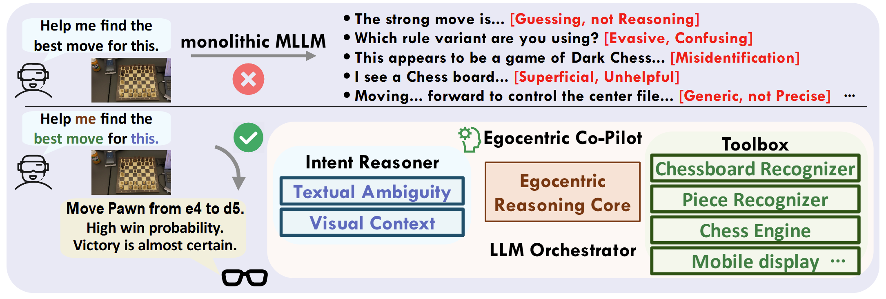

<div align="center">

# Egocentric Co-Pilot: Web-Native Smart-Glasses Agents for Assistive Egocentric AI

[](https://www2026.thewebconf.org/)
[](https://arxiv.org/abs/2603.01104)
[](https://youtu.be/U3KBN_3PG6M)
[](https://www.bilibili.com/video/BV1rrPVziEzm/)

*Sicheng Yang, Yukai Huang, Weitong Cai, Shitong Sun, Fengyi Fang, You He, Yiqiao Xie, Jiankang Deng, Hang Zhang, Jifei Song, Zhensong Zhang.*

</div>

---

## 🧩 System Architecture

<p align="center">
  
</p>

---

## 🎥 Video Demos

We provide system demonstrations in multiple languages and accents:

| Language / Accent            |                YouTube                |                       Bilibili                       |
| :--------------------------- | :-----------------------------------: | :---------------------------------------------------: |
| **English**            | [📺 Watch](https://youtu.be/U3KBN_3PG6M) | [📺 Watch](https://www.bilibili.com/video/BV1rrPVziEzm/) |
| **Chinese (Mandarin)** | [📺 Watch](https://youtu.be/ADaOSkT8xTo) | [📺 Watch](https://www.bilibili.com/video/BV1rrPVziEiK/) |
| **Taiwanese Accent**   | [📺 Watch](https://youtu.be/Ba4ROBLuwq8) | [📺 Watch](https://www.bilibili.com/video/BV1rrPVzqEvn/) |

---

## 📂 Project Structure & Modules

Click on the badges at the top of the page or the links below to navigate to the specific modules:

* **[`Egocentric-Reasoning-Core`](https://github.com/YoungSeng/Egocentric-Co-Pilot/tree/main/Egocentric-Reasoning-Core)**
  Contains our core reasoning model and fine-tuning (SFT) implementation for Multimodal LLMs (based on Qwen2.5-VL), including our Temporal Chain-of-Thought (T-CoT) strategy and HCC module. *(2nd Place Solution for the HD-EPIC VQA Challenge, CVPR 2025 EgoVis Workshop)*.
* **[`LLM-Orchestrated-Neuro-Symbolic-Execution`](https://github.com/YoungSeng/Egocentric-Co-Pilot/tree/main/LLM-Orchestrated-Neuro-Symbolic-Execution)**
  The back-end environment for egocentric AI and interactive systems. Includes our WebSocket server setup, TTS integration (F5-TTS), and visual interface processing.
* **[`On-Device-Perception-and-Interaction`](https://github.com/YoungSeng/Egocentric-Co-Pilot/tree/main/On-Device-Perception-and-Interaction)**
  The Android front-end application built with CameraX. It handles real-time visual perception, port forwarding, and WebSocket communication with the back-end.
* **[`Proactive-Multimodal-Intent-Disambiguation`](https://github.com/YoungSeng/Egocentric-Co-Pilot/tree/main/Proactive-Multimodal-Intent-Disambiguation)**
  Integrates our plug-and-play clarifier mechanism for the egocentric assistant. For the complete original codebase of this specific module, you can also refer to [YoungSeng/plug-and-play-clarifier](https://github.com/YoungSeng/plug-and-play-clarifier).

---

## ✅ TODO List

- [X] **Egocentric Reasoning Core** (Pre-trained models, SFT, T-CoT, and HCC)
- [X] **LLM Orchestration & Execution** (WebSocket backend, TTS integration)
- [X] **On-Device Perception** (Android CameraX App)
- [X] **Proactive Intent Disambiguation** (Plug-and-play clarifier)
- [X] **WebRTC Integration** (aiortc backend, VAD + faster-whisper)
- [ ] **External Tools Support** (*In Progress*)

---

## 🤝 Contact & Issues

Thank you for your interest in our work! If you have any questions, suggestions, or encounter any bugs while running the code, please feel free to **open an issue** in this repository. We will be happy to assist you.

---

### Citation

If you find this work helpful, please consider citing us:

```bibtex
@inproceedings{yang2026egocentric,
  title={Egocentric Co-Pilot: Web-Native Smart-Glasses Agents for Assistive Egocentric AI},
  author={Yang, Sicheng and Huang, Yukai and Cai, Weitong and Sun, Shitong and Fang, Fengyi and He, You and Xie, Yiqiao and Deng, Jiankang and Zhang, Hang and Song, Jifei and Zhang, Zhensong},
  booktitle={Proceedings of the ACM Web Conference 2026 (WWW)},
  year={2026}
}
```

[//]: #
[//]: #
[//]: #
[//]: #
[//]: #
[//]: #
